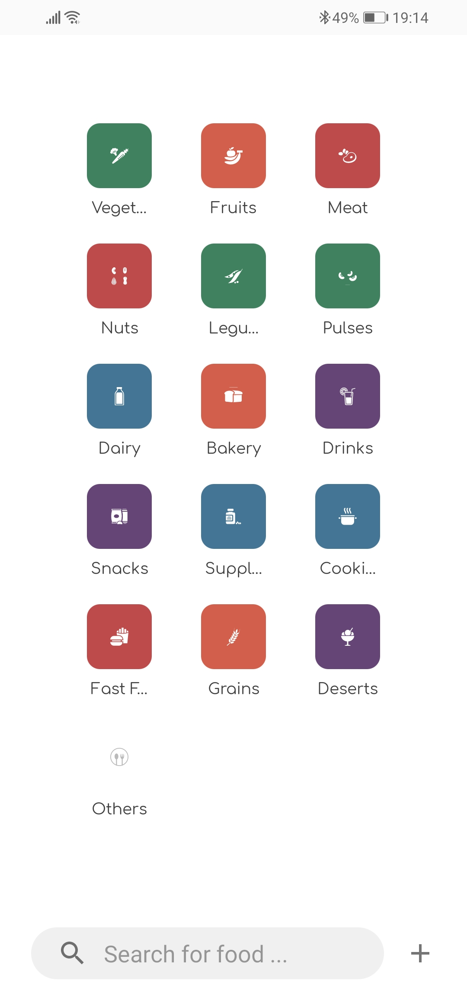

# DietCalculator
A calories counter Android app that calculates the calories in your daily diet and help you achieve your weight target.  
 

<kbd>
  

     
    
    
    
    
     
  

</kbd>

## Main Features
* Customized Targets: Based on body metrics and weight gain/loss goals.
* Create Food Items: Allows creating new food items from nutrients data.
* Create Recipes: Allows creating new recipes using saved food ingredients.
* Food Database: Saves food items from the diary for easier selection in future.
* Calories Counter: Counts the daily amount of calories from foods, recipes and workout.
* USDA Food Database: Allows searching for food items in USDA FoodData Central database.
* Progress chart: Displays weight gain/loss over time and how close are you to acheiving your goals.
* Macros: Displays the daily macros percentage which are the amount of Carbohydrates, Protein and Fat are there in your diet.
